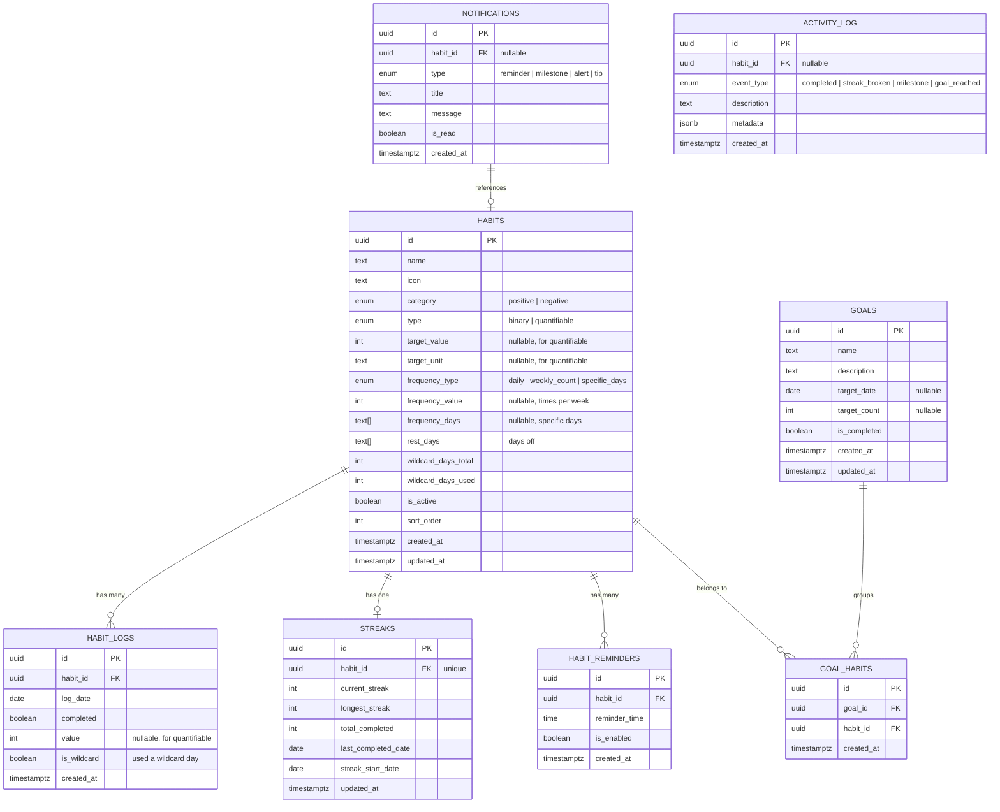

# 📋 Documento de Requisitos del Software (SRS)
## Habit Tracker — Web Application

**Versión:** 2.0  
**Fecha:** 13 de Marzo de 2026  
**Autor:** Generado con Google Anti Gravity  
**Última Actualización:** Refinado con referencia visual de UI

---

## 1. Introducción

### 1.1 Propósito
Este documento define los requisitos funcionales y no funcionales para el desarrollo de **Habit Tracker**, una aplicación web de una sola página (SPA) diseñada para ayudar a los usuarios a crear, registrar y mantener hábitos de forma consistente mediante un sistema de rachas, recordatorios y estadísticas visuales.

### 1.2 Alcance
Habit Tracker cubre el ciclo completo del usuario:

> **Crear hábito → Registro diario → Visualizar racha → Recibir recordatorios → Consultar estadísticas → Compartir progreso**

La aplicación será responsiva, visualmente atractiva con estilo **Glassmorphism** y diseñada para maximizar la retención del usuario a través de gratificación instantánea y mecánicas psicológicas de compromiso.

### 1.3 Stack Tecnológico

| Capa | Tecnología |
|---|---|
| **Framework** | Next.js |
| **Estilos** | Tailwind CSS |
| **Backend / Base de datos** | Supabase (PostgreSQL + Auth + Realtime) |
| **Persistencia** | Supabase Database (con fallback a LocalStorage offline) |
| **Notificaciones** | Push Notifications del navegador |

---

## 2. Descripción General del Producto

### 2.1 Perspectiva del Producto
Habit Tracker es una **SPA (Single Page Application)** web, responsive y accesible desde cualquier navegador moderno. Utiliza **Supabase** como backend para persistir los datos del usuario en una base de datos PostgreSQL.

### 2.2 Usuarios Objetivo
Cualquier persona que desee establecer, rastrear y mantener hábitos personales de forma visual y motivadora.

### 2.3 Principios de Diseño

- **Glassmorphism**: Paneles translúcidos con efecto de vidrio esmerilado, sombras suaves y colores vibrantes sobre fondos con degradados.
- **Minimalismo Vibrante**: Interfaz limpia con paleta azul/índigo como color primario, acentos brillantes y tipografía moderna.
- **Micro-interacciones**: Animaciones de confetti al completar registros diarios y transiciones suaves entre estados.
- **Regla de los 2 taps**: Cualquier registro de hábito debe completarse en máximo 2 interacciones.
- **Layout Dashboard**: Diseño de dos columnas en desktop con sidebar de navegación lateral permanente.

---

## 3. Arquitectura de Pantallas (Basada en UI de Referencia)

### 3.1 Layout Principal

```
┌──────────┬────────────────────────────────────────────────┐
│          │  [🔍 Search]                        [👤 Avatar]│
│  ♥ Habits├────────────────────────────────────────────────┤
│          │                                                │
│ ■ Habits │   ┌─────────┬─────────┬──────────┬──────────┐  │
│ ◎ Goals  │   │  40%    │    5    │    2     │    3     │  │
│ 📊 Analyt│   │Progress │ Active  │Completed │Left Today│  │
│ 🕐 Histor│   └─────────┴─────────┴──────────┴──────────┘  │
│ 💡 Tips  │                                                │
│ 🔔 Notif.│  ┌──── COLUMN LEFT ────┬── COLUMN RIGHT ────┐ │
│          │  │ Positive Habits     │ Calendar (Month)    │ │
│          │  │ • Habit cards...    │                     │ │
│          │  │ + Add new           │ Habit Progress      │ │
│          │  │                     │ Over Time           │ │
│          │  │ Negative Habits     │ (Chart + Metrics)   │ │
│          │  │ • Habit cards...    │                     │ │
│ ⚙ Settings│ │ + Add new           │                     │ │
│ 🚪 Logout│  └─────────────────────┴─────────────────────┘ │
└──────────┴────────────────────────────────────────────────┘
```

### 3.2 Navegación Lateral (Sidebar)

| Ítem | Ícono | Ruta | Descripción |
|---|---|---|---|
| **Habits** | 📋 | `/` | Pantalla principal. Dashboard con registro diario. |
| **Goals** | 🎯 | `/goals` | Metas a largo plazo vinculadas a hábitos. |
| **Analytics** | 📊 | `/analytics` | Estadísticas detalladas, gráficos y mapas de calor. |
| **History** | 🕐 | `/history` | Historial cronológico de actividad y registros. |
| **Tips** | 💡 | `/tips` | Consejos y recomendaciones para mantener hábitos. |
| **Notifications** | 🔔 | `/notifications` | Centro de notificaciones con badge contador. |
| **Settings** | ⚙️ | `/settings` | Configuración de la app, exportar/importar datos. |
| **Logout** | 🚪 | — | Cerrar sesión (para uso futuro con auth). |

### 3.3 Componentes de la Pantalla Principal (Habits)

#### 3.3.1 Barra Superior (Top Bar)
- **Barra de búsqueda**: Permite buscar hábitos por nombre.
- **Avatar del usuario**: Muestra la imagen de perfil o un placeholder.

#### 3.3.2 Fila de Tarjetas de Resumen (Stats Cards)
Cuatro tarjetas con métricas del día actual:

| Tarjeta | Métrica | Ejemplo |
|---|---|---|
| **Today's Progress** | Porcentaje de completitud del día | 40% |
| **Active Habits** | Total de hábitos activos | 5 |
| **Completed** | Hábitos completados hoy | 2 |
| **Left Today** | Hábitos pendientes hoy | 3 |

#### 3.3.3 Columna Izquierda — Listas de Hábitos

**Sección: Positive Habits** (colapsable con icono ∧)
- Lista de hábitos positivos que el usuario quiere construir.
- Cada tarjeta de hábito muestra:
  - **Ícono** del hábito
  - **Nombre** del hábito
  - **Frecuencia**: "Daily", "3x per week", "Daily 5/7" (para cuantificables)
  - **Racha**: "🔥 7-day streak"
  - **Checkbox / Toggle** para marcar como completado (verde ✅ cuando está completado)
- Botón **"+ Add new"** para crear un nuevo hábito positivo.

**Sección: Negative Habits** (colapsable con icono ∧)
- Lista de hábitos negativos que el usuario quiere dejar.
- Misma estructura de tarjeta que los positivos.
- Los checkboxes sin marcar indican que el usuario NO ha caído en el hábito negativo (éxito).
- Botón **"+ Add new"** para crear un nuevo hábito negativo.

#### 3.3.4 Columna Derecha — Calendario y Progreso

**Calendario Mensual**:
- Vista de mes completo con navegación (← →).
- El día actual resaltado con un círculo azul.
- Los días completados tienen una marca visual diferenciada.

**Habit Progress Over Time**:
- **Métricas superiores**: Racha actual, racha más larga, total completados.
- **Filtro por hábito**: Dropdown "All Progress" para filtrar por hábito individual.
- **Selector de período**: Tabs para "Weekly", "Monthly", "Yearly".
- **Gráfico de línea**: Visualiza el porcentaje de completitud a lo largo del período seleccionado.

---

## 4. Requisitos Funcionales

### 4.1 RF-01: Creación y Gestión de Hábitos

| Campo | Detalle |
|---|---|
| **ID** | RF-01 |
| **Prioridad** | Alta |
| **Descripción** | El usuario puede crear, editar y eliminar hábitos personalizados, clasificados como positivos o negativos. |

**Criterios de aceptación:**
- El usuario puede crear un hábito con los siguientes campos:
  - **Nombre** del hábito (obligatorio)
  - **Ícono o emoji** representativo
  - **Categoría**: Positivo (hábito a construir) o Negativo (hábito a eliminar)
  - **Tipo de hábito**: Binario (Sí/No) o Cuantificable (con meta numérica y unidad)
  - **Frecuencia**: Diaria, N veces por semana, o días específicos de la semana
  - **Días de descanso**: Configuración de días en los que el hábito no aplica
  - **Recordatorio**: Hora preferida para la notificación
  - **Días comodín**: Cantidad de wildcards disponibles por período
- El usuario puede editar cualquier campo de un hábito existente.
- El usuario puede eliminar un hábito (con confirmación).
- Los hábitos se persisten en **Supabase Database**.

---

### 4.2 RF-02: Registro Diario de Hábitos

| Campo | Detalle |
|---|---|
| **ID** | RF-02 |
| **Prioridad** | **Crítica** |
| **Descripción** | Pantalla principal donde el usuario marca sus hábitos como completados. |

> [!CAUTION]
> Esta es la funcionalidad más crítica de la aplicación. Si el flujo de registro no es inmediato y satisfactorio (menos de 2 taps), el usuario abandona la app. **Debe ser la pantalla principal (Home).**

**Criterios de aceptación:**
- La pantalla principal muestra los hábitos del día separados en **"Positive Habits"** y **"Negative Habits"**.
- Cada sección es **colapsable/expandible** con un ícono de flecha (∧/∨).
- **Hábitos binarios**: Un solo click en el checkbox marca el hábito como completado (icono verde ✅). Un segundo click lo desmarca.
- **Hábitos cuantificables**: Muestra progreso parcial (ej: "Daily 5/7"). El usuario puede incrementar el progreso con interacción directa.
- Para **hábitos negativos**: El checkbox sin marcar significa éxito (no cayó en el hábito). Marcar el checkbox indica recaída.
- Al completar un hábito, se dispara una **animación de confetti** como refuerzo positivo.
- La **fila de Stats Cards** se actualiza en tiempo real al registrar hábitos.
- Los registros se almacenan con la fecha correspondiente en Supabase.
- El usuario puede navegar a días anteriores mediante el **calendario mensual** en la columna derecha.

---

### 4.3 RF-03: Sistema de Rachas (Streaks)

| Campo | Detalle |
|---|---|
| **ID** | RF-03 |
| **Prioridad** | Alta |
| **Descripción** | Visualización de rachas consecutivas para motivar la consistencia. |

> [!IMPORTANT]
> Este es el **motor de retención psicológica** de la app. El efecto *"no quiero romper mi racha de 21 días"* es lo que mantiene al usuario volviendo. Debe ser visualmente impactante.

**Criterios de aceptación:**
- Cada tarjeta de hábito muestra su racha actual con ícono de fuego (ej: "🔥 7-day streak").
- La racha se **rompe estrictamente** si el usuario falla un día programado.
- Los **días de descanso configurados** no cuentan como días fallidos (no rompen la racha).
- El usuario tiene la opción de usar **"días comodín"** limitados que le permiten preservar la racha en caso de una falla puntual.
- Al alcanzar hitos de racha (7, 14, 21, 30, 60, 90, 365 días), se muestra una **animación especial de celebración**.
- Se registra la **racha más larga** alcanzada históricamente por cada hábito.
- En la sección **"Habit Progress Over Time"**, se muestran:
  - Racha actual (Current streak)
  - Racha más larga histórica (Longest streak ever)
  - Total completados (Completed in total)

---

### 4.4 RF-04: Sistema de Recordatorios y Notificaciones

| Campo | Detalle |
|---|---|
| **ID** | RF-04 |
| **Prioridad** | Media |
| **Descripción** | Notificaciones push del navegador y centro de notificaciones in-app. |

**Criterios de aceptación:**
- El sistema solicita permisos de **Push Notifications** del navegador al usuario.
- El usuario puede configurar una hora de recordatorio por cada hábito.
- Las notificaciones se muestran en el horario configurado.
- En el **sidebar**, el ítem **"Notifications"** muestra un **badge numérico** con la cantidad de notificaciones pendientes (ej: "🔔 2").
- La página `/notifications` muestra un listado completo de:
  - Recordatorios de hábitos pendientes del día.
  - Celebraciones de hitos de racha alcanzados.
  - Alertas de rachas en riesgo.
- El usuario puede activar/desactivar los recordatorios globalmente o por hábito.

---

### 4.5 RF-05: Estadísticas y Análisis (Analytics)

| Campo | Detalle |
|---|---|
| **ID** | RF-05 |
| **Prioridad** | Media |
| **Descripción** | Panel de estadísticas con visualización de datos históricos del usuario. |

**Criterios de aceptación:**

**En el Dashboard Principal (columna derecha):**
- **Gráfico de línea semanal**: Muestra el porcentaje de completitud diaria de los últimos 7 días.
- **Selector de período**: Tabs para alternar entre "Weekly", "Monthly" y "Yearly".
- **Filtro por hábito**: Dropdown "All Progress" para ver estadísticas de un hábito individual o todos combinados.
- **Métricas rápidas**: Racha actual, racha más larga, total completados.

**En la página completa de Analytics (`/analytics`):**
- **Mapa de calor anual** (estilo contribuciones de GitHub): Visualiza la consistencia a lo largo de todo el año con intensidad de color proporcional al cumplimiento.
- **Gráfico de barras semanal**: Tasa de completitud por día de la semana.
- **Métricas generales**:
  - Racha actual y racha más larga (por hábito y global).
  - Porcentaje de cumplimiento semanal / mensual.
  - Total de días completados.
  - Hábito más consistente y menos consistente.
- Los gráficos utilizan el estilo Glassmorphism con colores vibrantes.

---

### 4.6 RF-06: Búsqueda de Hábitos

| Campo | Detalle |
|---|---|
| **ID** | RF-06 |
| **Prioridad** | Media |
| **Descripción** | Barra de búsqueda en la parte superior para filtrar hábitos rápidamente. |

**Criterios de aceptación:**
- La barra de búsqueda filtra hábitos por nombre en tiempo real (debounced).
- Los resultados se muestran en las listas de "Positive Habits" y "Negative Habits" simultáneamente.
- Si no hay resultados, se muestra un mensaje amigable.

---

### 4.7 RF-07: Calendario Mensual

| Campo | Detalle |
|---|---|
| **ID** | RF-07 |
| **Prioridad** | Media |
| **Descripción** | Widget de calendario para navegar entre días y visualizar actividad histórica. |

**Criterios de aceptación:**
- Se muestra el mes actual con navegación (← →) para cambiar de mes.
- El día actual se resalta con un círculo azul.
- Los días con hábitos completados se marcan visualmente (color/punto).
- Al hacer clic en un día, los hábitos de la columna izquierda se actualizan para mostrar el estado de ese día.

---

### 4.8 RF-08: Metas (Goals)

| Campo | Detalle |
|---|---|
| **ID** | RF-08 |
| **Prioridad** | Baja |
| **Descripción** | Metas a largo plazo que agrupan o se vinculan con hábitos específicos. |

**Criterios de aceptación:**
- El usuario puede crear metas (ej: "Leer 12 libros este año").
- Las metas pueden vincularse a uno o más hábitos existentes.
- Se muestra el progreso visual de la meta basado en la actividad de los hábitos vinculados.

---

### 4.9 RF-09: Historial de Actividad

| Campo | Detalle |
|---|---|
| **ID** | RF-09 |
| **Prioridad** | Baja |
| **Descripción** | Registro cronológico de toda la actividad del usuario. |

**Criterios de aceptación:**
- Vista de feed cronológico con las acciones recientes (completados, rachas rotas, hitos alcanzados).
- Filtros por tipo de evento y por hábito.
- Paginación o scroll infinito.

---

### 4.10 RF-10: Tips y Consejos

| Campo | Detalle |
|---|---|
| **ID** | RF-10 |
| **Prioridad** | Baja |
| **Descripción** | Sección con consejos y recomendaciones basadas en ciencia del hábito. |

**Criterios de aceptación:**
- Biblioteca de tips estáticos sobre formación de hábitos.
- Tips contextuales basados en la actividad del usuario (ej: "Llevas 3 días sin completar X, ¿necesitas ajustar la frecuencia?").

---

### 4.11 RF-11: Compartir en Redes Sociales

| Campo | Detalle |
|---|---|
| **ID** | RF-11 |
| **Prioridad** | Baja |
| **Descripción** | Generar imágenes compartibles con el progreso del usuario. |

**Criterios de aceptación:**
- El usuario puede generar una **imagen visualmente atractiva** con información de su racha y estadísticas.
- La imagen incluye: nombre del hábito, racha actual, mapa de calor mini y branding de la app.
- La imagen se puede descargar o compartir directamente a redes sociales usando la **Web Share API** del navegador.

---

## 5. Requisitos No Funcionales

### 5.1 RNF-01: Rendimiento
- La pantalla principal debe cargar en menos de **2 segundos**.
- Las animaciones deben ejecutarse a **60 FPS** sin jank visual.
- El registro de hábitos debe completarse en menos de **2 interacciones** (regla de los 2 taps).
- Las queries a Supabase deben resolverse en menos de **500ms**.

### 5.2 RNF-02: Responsividad
- La aplicación debe ser completamente **responsive**, adaptándose a pantallas de:
  - Móvil (320px — 480px): Sidebar colapsable como drawer.
  - Tablet (481px — 1024px): Sidebar colapsada, contenido de una columna.
  - Desktop (1025px+): Layout completo de dos columnas con sidebar visible.
- El diseño prioriza **desktop-first** (según el UI de referencia), con adaptaciones mobile.

### 5.3 RNF-03: Compatibilidad
- Debe funcionar en navegadores modernos: **Chrome, Firefox, Safari, Edge** (últimas 2 versiones).
- Las notificaciones push requieren soporte del navegador (se degrada con gracia si no está soportado).

### 5.4 RNF-04: Persistencia de Datos
- Los datos se almacenan en **Supabase Database** (PostgreSQL).
- Se debe implementar un mecanismo de **exportar/importar datos** en formato JSON desde Settings.
- Fallback a **LocalStorage** para modo offline básico.

### 5.5 RNF-05: Accesibilidad
- Cumplir con estándares **WCAG 2.1 nivel AA** en contraste de colores y navegación por teclado.
- Todos los elementos interactivos deben tener **labels** descriptivos.

### 5.6 RNF-06: Estilo Visual
- Estilo principal: **Glassmorphism** (paneles translúcidos, blur de fondo, bordes sutiles).
- Color primario: **Azul/Índigo** (#3B5BDB o similar) como se ve en la UI de referencia.
- Fondo: Gris claro (#F5F6FA) con paneles blancos translúcidos.
- Tipografía moderna (ej: Inter, Outfit o similar de Google Fonts).
- Micro-animaciones y transiciones suaves en todas las interacciones.
- Tarjetas con bordes redondeados y sombras suaves.

---

## 6. Modelo de Datos — Supabase (PostgreSQL)

### 6.1 Diagrama Entidad-Relación



### 6.2 Detalle de Tablas

#### `habits` — Tabla principal de hábitos
```sql
CREATE TABLE habits (
    id              UUID PRIMARY KEY DEFAULT gen_random_uuid(),
    name            TEXT NOT NULL,
    icon            TEXT DEFAULT '📌',
    category        TEXT NOT NULL CHECK (category IN ('positive', 'negative')),
    type            TEXT NOT NULL CHECK (type IN ('binary', 'quantifiable')),
    target_value    INTEGER,          -- Solo para tipo 'quantifiable' (ej: 8)
    target_unit     TEXT,             -- Solo para tipo 'quantifiable' (ej: 'vasos')
    frequency_type  TEXT NOT NULL DEFAULT 'daily' 
                    CHECK (frequency_type IN ('daily', 'weekly_count', 'specific_days')),
    frequency_value INTEGER,          -- Para 'weekly_count' (ej: 3 = "3x per week")
    frequency_days  TEXT[],           -- Para 'specific_days' (ej: {'mon','tue','wed'})
    rest_days       TEXT[] DEFAULT '{}',
    wildcard_days_total  INTEGER DEFAULT 0,
    wildcard_days_used   INTEGER DEFAULT 0,
    is_active       BOOLEAN DEFAULT TRUE,
    sort_order      INTEGER DEFAULT 0,
    created_at      TIMESTAMPTZ DEFAULT NOW(),
    updated_at      TIMESTAMPTZ DEFAULT NOW()
);
```

#### `habit_logs` — Registros diarios
```sql
CREATE TABLE habit_logs (
    id          UUID PRIMARY KEY DEFAULT gen_random_uuid(),
    habit_id    UUID NOT NULL REFERENCES habits(id) ON DELETE CASCADE,
    log_date    DATE NOT NULL,
    completed   BOOLEAN DEFAULT FALSE,
    value       INTEGER,              -- Progreso parcial para cuantificables
    is_wildcard BOOLEAN DEFAULT FALSE,
    created_at  TIMESTAMPTZ DEFAULT NOW(),
    UNIQUE(habit_id, log_date)        -- Solo un registro por hábito por día
);
```

#### `streaks` — Rachas por hábito
```sql
CREATE TABLE streaks (
    id                  UUID PRIMARY KEY DEFAULT gen_random_uuid(),
    habit_id            UUID NOT NULL UNIQUE REFERENCES habits(id) ON DELETE CASCADE,
    current_streak      INTEGER DEFAULT 0,
    longest_streak      INTEGER DEFAULT 0,
    total_completed     INTEGER DEFAULT 0,
    last_completed_date DATE,
    streak_start_date   DATE,
    updated_at          TIMESTAMPTZ DEFAULT NOW()
);
```

#### `habit_reminders` — Recordatorios configurables
```sql
CREATE TABLE habit_reminders (
    id            UUID PRIMARY KEY DEFAULT gen_random_uuid(),
    habit_id      UUID NOT NULL REFERENCES habits(id) ON DELETE CASCADE,
    reminder_time TIME NOT NULL,
    is_enabled    BOOLEAN DEFAULT TRUE,
    created_at    TIMESTAMPTZ DEFAULT NOW()
);
```

#### `goals` — Metas a largo plazo
```sql
CREATE TABLE goals (
    id            UUID PRIMARY KEY DEFAULT gen_random_uuid(),
    name          TEXT NOT NULL,
    description   TEXT,
    target_date   DATE,
    target_count  INTEGER,
    is_completed  BOOLEAN DEFAULT FALSE,
    created_at    TIMESTAMPTZ DEFAULT NOW(),
    updated_at    TIMESTAMPTZ DEFAULT NOW()
);
```

#### `goal_habits` — Relación muchos a muchos entre Goals y Habits
```sql
CREATE TABLE goal_habits (
    id         UUID PRIMARY KEY DEFAULT gen_random_uuid(),
    goal_id    UUID NOT NULL REFERENCES goals(id) ON DELETE CASCADE,
    habit_id   UUID NOT NULL REFERENCES habits(id) ON DELETE CASCADE,
    created_at TIMESTAMPTZ DEFAULT NOW(),
    UNIQUE(goal_id, habit_id)
);
```

#### `notifications` — Centro de notificaciones in-app
```sql
CREATE TABLE notifications (
    id         UUID PRIMARY KEY DEFAULT gen_random_uuid(),
    habit_id   UUID REFERENCES habits(id) ON DELETE SET NULL,
    type       TEXT NOT NULL CHECK (type IN ('reminder', 'milestone', 'alert', 'tip')),
    title      TEXT NOT NULL,
    message    TEXT NOT NULL,
    is_read    BOOLEAN DEFAULT FALSE,
    created_at TIMESTAMPTZ DEFAULT NOW()
);
```

#### `activity_log` — Historial de actividad
```sql
CREATE TABLE activity_log (
    id          UUID PRIMARY KEY DEFAULT gen_random_uuid(),
    habit_id    UUID REFERENCES habits(id) ON DELETE SET NULL,
    event_type  TEXT NOT NULL CHECK (event_type IN (
        'completed', 'streak_broken', 'milestone', 'goal_reached', 'habit_created', 'habit_deleted'
    )),
    description TEXT NOT NULL,
    metadata    JSONB DEFAULT '{}',
    created_at  TIMESTAMPTZ DEFAULT NOW()
);
```

### 6.3 Índices Recomendados
```sql
-- Búsqueda frecuente de logs por hábito y fecha
CREATE INDEX idx_habit_logs_habit_date ON habit_logs(habit_id, log_date DESC);

-- Filtrar hábitos activos por categoría
CREATE INDEX idx_habits_category_active ON habits(category, is_active);

-- Notificaciones no leídas
CREATE INDEX idx_notifications_unread ON notifications(is_read) WHERE is_read = FALSE;

-- Historial de actividad por fecha
CREATE INDEX idx_activity_log_created ON activity_log(created_at DESC);

-- Búsqueda de texto en hábitos
CREATE INDEX idx_habits_name_search ON habits USING gin(to_tsvector('spanish', name));
```

### 6.4 Queries Clave para la UI

```sql
-- Dashboard Stats Cards: métricas del día actual
SELECT
    COUNT(*) FILTER (WHERE hl.completed = TRUE) AS completed_today,
    COUNT(*) AS active_today,
    COUNT(*) FILTER (WHERE hl.completed = FALSE OR hl.id IS NULL) AS left_today,
    ROUND(
        COUNT(*) FILTER (WHERE hl.completed = TRUE)::DECIMAL /
        NULLIF(COUNT(*), 0) * 100
    ) AS progress_percent
FROM habits h
LEFT JOIN habit_logs hl ON h.id = hl.habit_id AND hl.log_date = CURRENT_DATE
WHERE h.is_active = TRUE;

-- Habit Progress Over Time (Weekly): completitud por día
SELECT
    hl.log_date,
    ROUND(
        COUNT(*) FILTER (WHERE hl.completed = TRUE)::DECIMAL /
        NULLIF(COUNT(*), 0) * 100
    ) AS completion_rate
FROM habit_logs hl
WHERE hl.log_date >= CURRENT_DATE - INTERVAL '7 days'
GROUP BY hl.log_date
ORDER BY hl.log_date;

-- Heatmap anual: días completados por día del año
SELECT
    hl.log_date,
    COUNT(*) FILTER (WHERE hl.completed = TRUE) AS completed_count,
    COUNT(*) AS total_count
FROM habit_logs hl
WHERE hl.log_date >= DATE_TRUNC('year', CURRENT_DATE)
GROUP BY hl.log_date
ORDER BY hl.log_date;
```

---

## 7. Priorización de Desarrollo

| Fase | Funcionalidad | Prioridad |
|---|---|---|
| **Fase 1** | RF-01: Creación de Hábitos (+ categorías Pos/Neg) | 🟢 Alta |
| **Fase 1** | RF-02: Registro Diario (pantalla principal) | 🔴 Crítica |
| **Fase 1** | RF-03: Sistema de Rachas | 🟢 Alta |
| **Fase 1** | RF-07: Calendario Mensual | 🟢 Alta |
| **Fase 2** | RF-04: Recordatorios y Notificaciones | 🟡 Media |
| **Fase 2** | RF-05: Estadísticas (Dashboard + Analytics page) | 🟡 Media |
| **Fase 2** | RF-06: Búsqueda de Hábitos | 🟡 Media |
| **Fase 3** | RF-08: Metas (Goals) | 🔵 Baja |
| **Fase 3** | RF-09: Historial de Actividad | 🔵 Baja |
| **Fase 3** | RF-10: Tips y Consejos | 🔵 Baja |
| **Fase 3** | RF-11: Compartir en Redes Sociales | 🔵 Baja |

---

## 8. Glosario

| Término | Definición |
|---|---|
| **Hábito Positivo** | Hábito que el usuario desea construir y mantener (ej: meditar, leer). |
| **Hábito Negativo** | Hábito que el usuario desea eliminar o reducir (ej: fumar, beber). |
| **Hábito Binario** | Hábito que se registra como completado (Sí) o no completado (No). |
| **Hábito Cuantificable** | Hábito que tiene una meta numérica (ej: 8 vasos de agua) y se registra con progreso parcial. |
| **Racha (Streak)** | Número de días consecutivos en los que un hábito fue completado exitosamente. |
| **Día de Descanso** | Día configurado en el que el hábito no aplica y no afecta la racha. |
| **Día Comodín (Wildcard)** | Día en el que el usuario puede "perdonar" una falla sin romper su racha. Limitado en cantidad. |
| **Glassmorphism** | Estilo de diseño UI con paneles translúcidos, efecto de desenfoque y bordes sutiles. |
| **SPA** | Single Page Application — aplicación web que se ejecuta en una sola página sin recargas completas. |
| **Stats Cards** | Tarjetas de resumen con métricas del día actual en la parte superior del dashboard. |
